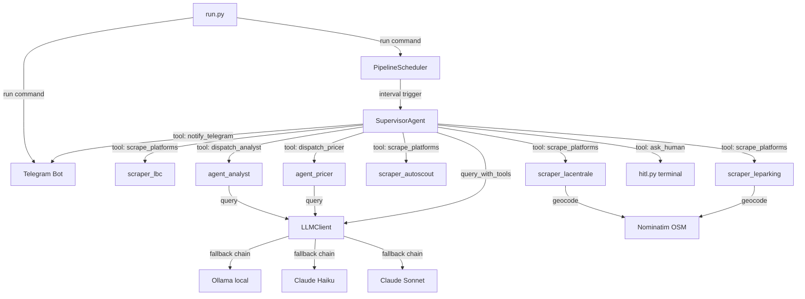

# Toyota iQ Agentic Car Search System

**Version:** 4.2
**Last updated:** 2026-03-28
**Owner:** Jerome Martin
**Stack:** Python 3.13, local (WS-002, Windows 11)
**Status:** Stable

---

## Table of Contents

- [Project Overview](#project-overview)
- [Architecture & Infrastructure Map](#architecture--infrastructure-map)
- [Logic Walkthrough](#logic-walkthrough)
- [Configuration Reference](#configuration-reference)
- [Prompts Catalogue](#prompts-catalogue)
- [Usage Guide](#usage-guide)
- [Hints & Gotchas](#hints--gotchas)
- [Cheat Sheet](#cheat-sheet)
- [Glossary](#glossary)

---

## Project Overview

Agentic pipeline that scrapes 4 French used-car platforms for Toyota iQ automatics, scores them via LLM against a 100-point rubric, presents shortlists through Telegram and terminal, and generates French negotiation messages with pricing strategy. Runs as a single long-lived process: APScheduler fires the supervisor at configurable intervals, Telegram bot handles commands, terminal HITL available for local review.

Operator: Jerome Martin (for a friend near Orly airport).
Output: ranked shortlists + ready-to-send negotiation messages in French.

---

## Architecture & Infrastructure Map

### Directory Tree

```
_search_vehicles/
├── run.py                  # Entry point — PID lockfile + scheduler + Telegram bot, or CLI subcommands
├── config.py               # All constants, env vars, search criteria, scoring weights
├── models.py               # Pydantic v2: RawListing → ScoredListing → PricedListing
├── utils.py                # Haversine, distance zones, text cleanup, JSON extraction
├── state.py                # PipelineState persistence (JSON file)
├── llm_client.py           # Unified LLM client: Ollama → Haiku → Sonnet fallback
├── scraper_lbc.py          # LeBonCoin scraper (API + fallback)
├── scraper_lacentrale.py   # La Centrale scraper (__NEXT_DATA__ JSON) + geocoding
├── scraper_leparking.py    # Le Parking scraper (HTML parsing)
├── scraper_autoscout.py    # AutoScout24 scraper (__NEXT_DATA__ JSON)
├── agent_analyst.py        # Analyst agent — LLM scores listings against rubric
├── agent_pricer.py         # Pricer agent — market pricing + negotiation messages
├── agent_supervisor.py     # Supervisor agent — Claude Sonnet tool_use loop, 8 tools
├── hitl.py                 # Terminal HITL interface for shortlist review
├── telegram_bot.py         # Telegram bot — commands, notifications, dual chat
├── scheduler.py            # APScheduler wrapper — configurable interval
├── .env.example            # Template for env vars
├── .gitignore              # Excludes .env, _IQ/, __pycache__/
├── requirements.txt        # Python dependencies
├── CLAUDE.md               # Claude Code project instructions
├── PROJECT_DOC.md          # This file
├── _IQ/                    # Output directory (auto-created)
│   ├── raw_listings_*.json     # Scraped listings per day
│   ├── priced_*.json           # Priced listings per day
│   ├── state.json              # Pipeline state
│   ├── bot.pid                 # PID lockfile (auto-managed, prevents multiple instances)
│   └── geocode_cache.json      # Nominatim cache
├── tests/
│   ├── __init__.py
│   ├── test_config.py
│   ├── test_models.py
│   ├── test_utils.py
│   ├── test_state.py
│   ├── test_llm_client.py
│   ├── test_scraper_lbc.py
│   ├── test_scraper_lacentrale.py
│   ├── test_scraper_leparking.py
│   ├── test_scraper_autoscout.py
│   ├── test_analyst.py
│   ├── test_hitl.py
│   ├── test_pricer.py
│   ├── test_supervisor.py
│   ├── test_telegram.py
│   ├── test_run.py
│   ├── test_scheduler.py
│   └── fixtures/
│       ├── lbc_sample.json
│       ├── lacentrale_sample.html
│       ├── leparking_sample.html
│       └── autoscout_sample.json
└── docs/
    └── superpowers/
        ├── specs/      # Design spec
        └── plans/      # Implementation plan
```

### Component Diagram



### External Dependencies

| Service | Protocol | Purpose |
|---|---|---|
| LeBonCoin API | HTTPS | Car listings (JSON API) |
| La Centrale | HTTPS | Car listings (__NEXT_DATA__) |
| Le Parking | HTTPS | Car listings (HTML) |
| AutoScout24 | HTTPS | Car listings (__NEXT_DATA__) |
| Ollama (local) | HTTP :11434 | LLM scoring/pricing (primary) |
| Anthropic API | HTTPS | LLM fallback (Haiku, Sonnet) |
| Telegram Bot API | HTTPS | Notifications + commands |
| Nominatim OSM | HTTPS | City → GPS geocoding |

### Data Flow

```
4 scrapers → RawListing[] → dedup → analyst LLM → ScoredListing[]
→ HITL/Telegram review → approved IDs → pricer LLM → PricedListing[]
→ negotiation messages (FR) → Telegram notification
```

---

## Logic Walkthrough

### Default mode: `python run.py`

1. **PID lockfile check** — `_kill_old_instance()` reads `_IQ/bot.pid`, kills any existing bot process (SIGTERM → 3s wait → SIGKILL), removes stale PID file. Then `_write_pid()` writes current PID and registers atexit cleanup. Prevents Telegram 409 Conflict from multiple polling instances. [UPDATED 2026-03-28]
2. **Scheduler starts** — `PipelineScheduler` fires `run_pipeline()` every N hours (default 4h)
3. **Telegram bot starts** — `Application.run_polling()` blocks the main thread, listens for commands
4. **On schedule trigger**: `SupervisorAgent` instantiated, enters tool_use loop with Claude Sonnet
5. **Supervisor reads state** (`read_state` tool) — checks `_IQ/state.json` for freshness
6. **If stale (>4h)**: supervisor calls `scrape_platforms` with all 4 platforms
7. **Scraping**: each scraper runs sequentially with 2-5s random delays, returns `RawListing[]`
   - LBC: API endpoint with pagination, 403/429 fallback stub
   - La Centrale: `__NEXT_DATA__` JSON extraction from HTML
   - Le Parking: HTML div parsing with BeautifulSoup
   - AutoScout24: `__NEXT_DATA__` JSON extraction from HTML
8. **Dedup**: by `(title_lower, price, year, city_lower)` across all platforms
9. **Supervisor calls `dispatch_analyst`** — analyst LLM scores each listing against 100-point rubric
   - Uses `model_preference="local"` (Ollama first, then Haiku, then Sonnet)
   - Returns two sorted lists: shortlist_pro and shortlist_part (top N each)
10. **Supervisor calls `ask_human`** — routes to HITL terminal with full shortlist display
    - Global numbering: pro #1..N, private #N+1..M
    - User commands: `ok`, `ok 1,3`, `drop 2`, `details 3`, `rescrape`, `top 20`, `quit`
11. **If approved**: supervisor calls `dispatch_pricer` with approved IDs
    - Uses `model_preference="sonnet"` (Claude Sonnet directly)
    - Returns market estimates, opening offers, negotiation anchors, French messages
12. **Supervisor calls `notify_telegram`** to send results to friend + Jerome
13. **State saved** to `_IQ/state.json` after every supervisor action

### Standalone CLI subcommands

- `python run.py scrape` — runs all 4 scrapers, saves JSON, no LLM
- `python run.py analyze` — loads latest raw JSON, runs analyst, prints shortlist counts
- `python run.py price` — loads latest approved shortlist, runs pricer
- `python run.py status` — prints current pipeline state JSON

---

## Configuration Reference

### Environment Variables (.env)

| Variable | Type | Default | Required | Description |
|---|---|---|---|---|
| `ANTHROPIC_API_KEY` | string | `""` | Yes (for LLM) | Anthropic API key for Haiku/Sonnet |
| `OLLAMA_BASE_URL` | string | `http://localhost:11434` | No | Ollama local server URL |
| `OLLAMA_MODEL` | string | `llama3.1:8b` | No | Ollama model for analyst scoring |
| `TELEGRAM_BOT_TOKEN` | string | `""` | Yes (for Telegram) | Telegram bot API token |
| `TELEGRAM_FRIEND_CHAT_ID` | string | `""` | Yes (for Telegram) | Friend's Telegram chat ID |
| `TELEGRAM_JEROME_CHAT_ID` | string | `""` | Yes (for Telegram) | Jerome's Telegram chat ID |

### Hardcoded Constants (config.py)

| Constant | Value | Description |
|---|---|---|
| `SEARCH_CRITERIA.make` | `"Toyota"` | Target make |
| `SEARCH_CRITERIA.model` | `"iQ"` | Target model |
| `SEARCH_CRITERIA.transmission` | `"automatic"` | Must be automatic (CVT/iMT) |
| `SEARCH_CRITERIA.max_price` | `5000` | Max price in EUR |
| `SEARCH_CRITERIA.max_mileage_km` | `150000` | Max mileage in km |
| `SEARCH_CRITERIA.min_year` | `2009` | Minimum model year |
| `ORLY_LAT` / `ORLY_LON` | `48.7262` / `2.3652` | Reference point for distance scoring |
| `CACHE_FRESHNESS_HOURS` | `4` | Hours before data considered stale |
| `DEFAULT_INTERVAL_HOURS` | `4` | Default scheduler interval |
| `MIN_INTERVAL_HOURS` | `1` | Minimum scheduler interval |
| `MAX_INTERVAL_HOURS` | `168` | Maximum scheduler interval (1 week) |
| `LLM_MAX_RETRIES` | `2` | Retry count per model in fallback chain |
| `OUTPUT_DIR` | `_IQ/` | Output directory (relative to project root) |

### Scoring Weights (must sum to 100)

| Dimension | Weight | Description |
|---|---|---|
| `price` | 30 | Lower = better (5000=0, <2500=30) |
| `mileage` | 20 | Lower = better (150k=0, <50k=20) |
| `year` | 15 | Newer = better (2009=5, 2013+=15) |
| `proximity` | 15 | Closer to Orly = better |
| `condition` | 10 | Signals from description (capped at 10) |
| `transmission` | 10 | Confirmed auto = 10, manual = EXCLUDE |

### Distance Zones (from Orly)

| Zone | Max km | Bonus pts |
|---|---|---|
| PRIME | 20 | +15 |
| NEAR | 30 | +8 |
| FAR | 40 | +3 |
| REMOTE | >40 | 0 |

### Platform ID Prefixes

| Platform | Prefix | Scraper |
|---|---|---|
| LeBonCoin | `lbc_` | `scraper_lbc.py` |
| La Centrale | `lc_` | `scraper_lacentrale.py` |
| Le Parking | `lp_` | `scraper_leparking.py` |
| AutoScout24 | `as_` | `scraper_autoscout.py` |

---

## Prompts Catalogue

### Prompt: ANALYST_SYSTEM_PROMPT

**Model:** Ollama (local) → Claude Haiku → Claude Sonnet (fallback chain)
**Role:** system
**Purpose:** Score Toyota iQ listings against weighted 100-point rubric
**Input variables:** JSON array of listing objects (id, title, price, year, mileage_km, transmission, city, lat, lon, seller_type, description)
**Expected output:** JSON array of scored objects with score, score_breakdown, excluded, red_flags, highlights, concerns, summary_fr
**Notes:** Must return ONLY a JSON array. Manual transmission = instant EXCLUDE (score -1). Price >5000 or mileage >150k = EXCLUDE.

```
--- PROMPT TEXT ---
You are a used car analyst specializing in the French market.

TASK: Score each Toyota iQ listing against the buyer's criteria.
Output a JSON ARRAY of objects, one per listing, with the exact schema below.

SCORING RUBRIC (100 points total):
- Price (30 pts): 5000€=0, 4000€=15, 3000€=25, <2500€=30
- Mileage (20 pts): 150k=0, 100k=10, 70k=15, <50k=20
- Year (15 pts): 2009=5, 2011=10, 2013+=15
- Proximity to Orly (15 pts): <20km=15, 20-30km=8, 30-40km=3, >40km=0
- Condition signals (10 pts, CAPPED at 10): "en l'etat"=-10, "accident"=-10, "CT OK"=+5, "carnet entretien"=+5, "1 proprietaire"=+5
- Transmission confirmed auto (10 pts): confirmed=10, unclear=0, manual=EXCLUDE

RED FLAGS (instant exclude or heavy penalty):
- Transmission = manual → EXCLUDE (score = -1)
- Price > 5000€ → EXCLUDE
- Mileage > 150000 km → EXCLUDE
- "en l'etat" / "accidente" / "pour pieces" → score = max 20
- "SIV" / fleet vehicle → -10 pts

OUTPUT SCHEMA (strict JSON array, no markdown, no explanation):
[{
  "id": "lbc_123456",
  "score": 72,
  "score_breakdown": {"price": 25, "mileage": 15, "year": 10, "proximity": 8, "condition": 10, "transmission": 10},
  "excluded": false,
  "exclusion_reason": null,
  "red_flags": [],
  "highlights": ["CT OK", "1 proprio"],
  "concerns": ["km eleve pour l'annee"],
  "summary_fr": "iQ 2011 68k km, bon etat, CT OK."
}]

IMPORTANT: Return ONLY a JSON array. No other text.
---
```

### Prompt: PRICER_SYSTEM_PROMPT

**Model:** Claude Sonnet (direct, no fallback)
**Role:** system
**Purpose:** Generate market pricing, negotiation strategy, and ready-to-send French messages
**Input variables:** JSON array of approved listings (id, title, price, year, mileage_km, city, seller_type, score, highlights, concerns, red_flags, description)
**Expected output:** JSON array with market_estimate_low/high, opening_offer, max_acceptable, anchors, message_digital, message_oral_points
**Notes:** French vouvoiement tone. Must return ONLY a JSON array.

```
--- PROMPT TEXT ---
You are a French used car negotiation expert.

For each approved listing, produce:
1. Market price estimate (fourchette basse/haute) based on year, km, condition
2. Recommended opening offer (aggressive but not insulting)
3. Maximum acceptable price (walk-away point)
4. Negotiation anchors: specific weak points to leverage (km, age, condition, market rarity)
5. A ready-to-send message in French (vouvoiement, polite but informed)
   - For digital platforms (LBC message, email)
6. Oral talking points for phone/in-person

TONE: Informed buyer, respectful, not desperate. Reference specific facts about the car.
Never insult the seller or the car. Use "je me permets de vous proposer" style.

OUTPUT SCHEMA (strict JSON array, no markdown):
[{
  "id": "lbc_123456",
  "market_estimate_low": 2500,
  "market_estimate_high": 3200,
  "opening_offer": 2400,
  "max_acceptable": 3000,
  "anchors": ["Kilometrage superieur a la moyenne", "CT a refaire"],
  "message_digital": "Bonjour, je me permets de vous contacter...",
  "message_oral_points": ["Mentionner le kilometrage", "Demander le carnet"]
}]

IMPORTANT: Return ONLY a JSON array. No other text.
---
```

### Prompt: Supervisor System Prompt

**Model:** Claude Sonnet (via tool_use API)
**Role:** system
**Purpose:** Orchestrate the full pipeline in a tool_use loop with 8 tools
**Input variables:** None (static prompt)
**Expected output:** Tool calls following the workflow
**Notes:** Max 20 iterations. Supervisor has 8 tools: scrape_platforms, get_raw_listings, dispatch_analyst, dispatch_pricer, ask_human, read_state, write_state, notify_telegram.

```
--- PROMPT TEXT ---
You are the supervisor of a car search mission for a Toyota iQ automatic.

YOUR MISSION: Find the best Toyota iQ automatic deals in France for a friend.
Budget: max 5000 EUR. Max 150k km. Min 2009. Automatic only.

YOU HAVE TOOLS. Use them. You are in a loop.

WORKFLOW:
1. Call read_state to check current pipeline state.
2. If no fresh data (last scrape > 4 hours), call scrape_platforms.
3. After scraping, call get_raw_listings to see the data.
4. Call dispatch_analyst to score and rank the listings.
5. Call ask_human to present shortlists and get approval.
6. If human approves listings, call dispatch_pricer for approved ones.
7. Present final pricing to human. Done.

DECISION RULES:
- 0 listings after scrape? Tell human via ask_human, suggest retry later.
- 1 platform failed? Continue with partial data, note it.
- Analyst returns bad output? Retry up to 2x with dispatch_analyst.
- Human says "rescrape"? Call scrape_platforms again.
- Human says "top N"? Call dispatch_analyst again with new top_n.
- Human says "quit"? Stop immediately.

NEVER proceed without validating the previous step output.
ALWAYS explain your reasoning before calling a tool.
---
```

---

## Usage Guide

### Prerequisites

- Python 3.10+ (tested on 3.13)
- Ollama running locally with `llama3.1:8b` loaded (optional but recommended)
- Anthropic API key (required for supervisor and pricer)
- Telegram bot token + chat IDs (required for Telegram features)

### Setup

```bash
cd G:\Downloads\_search_vehicles
pip install -r requirements.txt
cp .env.example .env
# Edit .env with your actual keys:
#   ANTHROPIC_API_KEY=sk-ant-...
#   TELEGRAM_BOT_TOKEN=123456:ABC-DEF
#   TELEGRAM_FRIEND_CHAT_ID=...
#   TELEGRAM_JEROME_CHAT_ID=...
```

### Run

```bash
# Full pipeline: scheduler + Telegram bot (long-running process)
python run.py

# One-shot scrape only (no LLM, no bot)
python run.py scrape

# Analyze latest scraped data
python run.py analyze

# Price latest approved shortlist
python run.py price

# Check pipeline state
python run.py status
```

### Telegram Commands (French)

| Command | Description |
|---|---|
| `/start` | Afficher les commandes disponibles |
| `/chercher` | Lancer une recherche immediate |
| `/liste` | Voir la shortlist actuelle |
| `/approuver 1,3,5` | Approuver des annonces par numero |
| `/rejeter 2,4` | Rejeter des annonces par numero |
| `/details 3` | Details complets de l'annonce #3 |
| `/intervalle 4h` | Changer la frequence (min 1h, max 1s) — h=heures, j=jours, s=semaine |
| `/statut` | Etat du pipeline |

### Expected Outputs

- `_IQ/raw_listings_YYYYMMDD.json` — all scraped listings
- `_IQ/priced_YYYYMMDD.json` — priced listings with negotiation messages
- `_IQ/state.json` — current pipeline state
- `_IQ/bot.pid` — PID lockfile (auto-managed, cleaned on exit)
- `_IQ/geocode_cache.json` — cached city GPS coordinates
- Telegram messages to friend + Jerome with formatted shortlists

### Running Tests

```bash
python -m pytest tests/ -v
# 263 tests, all should pass (~65s)
```

---

## Hints & Gotchas

- **409 Conflict protection**: `run.py` uses a PID lockfile (`_IQ/bot.pid`) to prevent multiple bot instances polling the same Telegram token. On startup, any existing instance is auto-killed (SIGTERM → 3s → SIGKILL). PID file is cleaned on exit via `atexit`. If you see 409 errors, kill all Python processes and restart. [UPDATED 2026-03-28]
- **Anti-detection delays**: all scrapers add 2-5s random sleep before HTTP requests. Do not remove these or you will get 403/429 blocked.
- **Geocoding rate limit**: Nominatim requires 1.1s between requests. The hardcoded city cache (24 French cities in `scraper_lacentrale.py`) avoids most Nominatim calls. Disk cache at `_IQ/geocode_cache.json` persists across runs.
- **LBC API changes frequently**: the `scrape_leboncoin()` function has a `_scrape_lbc_fallback()` stub for when the API returns 403. This fallback is not yet implemented.
- **Le Parking transmission**: Le Parking does not reliably display transmission type. Listings from Le Parking will have `transmission=None` and rely on the analyst LLM to detect from title/description.
- **Dedup key**: `(title_lower, price, year, city_lower)`. Le Parking is an aggregator — expect overlaps with LBC/La Centrale. Dedup handles this.
- **Supervisor max iterations**: 20 tool_use loops max. If the supervisor hits this, it saves state and exits. Restart continues from saved state.
- **Telegram plain text only**: all Telegram output is plain text, not Markdown. Telegram Markdown parsing is unreliable.
- **Single process**: scheduler, Telegram bot, and supervisor all run in one process. The bot's `run_polling()` blocks the main thread; the scheduler runs in a background thread.
- **State persistence**: `_IQ/state.json` is written after every supervisor tool call. Safe to kill and restart.
- **Anthropic tool_use**: the supervisor uses `query_with_tools()` which requires an Anthropic API key. Ollama cannot do tool_use. If no API key, the supervisor will crash.
- **Score -1**: a score of -1 means the listing was excluded (manual transmission, over-price, over-mileage). These are filtered out before shortlisting.
- **Global numbering**: in shortlists, pro listings are numbered 1..N, private listings continue N+1..M. This numbering is consistent across terminal and Telegram.

---

## Cheat Sheet

```
## Quick Reference — Toyota iQ Search

### Run
python run.py              # Full pipeline (scheduler + Telegram bot)
python run.py scrape       # Scrape all 4 platforms
python run.py analyze      # Score latest scrape via LLM
python run.py price        # Price approved shortlist
python run.py status       # Show pipeline state

### Telegram
/chercher                  # Lancer recherche
/liste                     # Voir shortlist
/approuver 1,3,5           # Approuver par numero
/rejeter 2,4               # Rejeter par numero
/intervalle 4h             # Changer frequence (1h-1s)
/statut                    # Etat pipeline

### HITL Terminal Commands
ok                         # Approve all
ok 1,3,7                   # Approve specific
drop 2,4                   # Remove from list
details 3                  # Full description
rescrape                   # Re-run scrapers
top 20                     # Change shortlist size
quit                       # Exit

### Key Files
run.py                     # Start here
config.py                  # All settings
.env                       # Secrets (API keys, tokens)
_IQ/state.json             # Pipeline state
_IQ/bot.pid                # PID lockfile (auto-managed)
_IQ/raw_listings_*.json    # Scraped data
_IQ/priced_*.json          # Pricing results

### Troubleshoot
409 Conflict               # Multiple bot instances — kill all: powershell "Get-Process python | Stop-Process"
No listings found          # Platforms may be blocking — check UA rotation
LLM timeout                # Check Ollama is running: curl http://localhost:11434/api/tags
Anthropic 401              # Check ANTHROPIC_API_KEY in .env
Telegram silent            # Check TELEGRAM_BOT_TOKEN and chat IDs
geocode_cache errors       # Delete _IQ/geocode_cache.json, will rebuild
State stuck                # Delete _IQ/state.json, pipeline restarts from init
```

---

## Glossary

**Analyst agent** — LLM-powered scoring module that evaluates listings against the 100-point rubric. Uses local Ollama first, falls back to Claude.

**CVT** — Continuously Variable Transmission. The Toyota iQ automatic uses a CVT (marketed as "Multidrive S"). The search targets these specifically.

**Dedup** — Cross-platform deduplication by `(title_normalized, price, year, city_normalized)`. Removes duplicates from Le Parking (aggregator) that also appear on LBC or La Centrale.

**Distance zone** — Concentric zones around Orly airport (PRIME <20km, NEAR 20-30km, FAR 30-40km, REMOTE >40km) that determine proximity bonus points.

**Fallback chain** — LLM model sequence tried in order: `local` = Ollama → Haiku → Sonnet; `haiku` = Haiku → Sonnet; `sonnet` = Sonnet only.

**HITL** — Human-In-The-Loop. Terminal-based interactive review where the operator approves, rejects, or inspects individual listings before pricing.

**Global numbering** — Unified numbering across pro and private shortlists: pro items #1..N, private items #N+1..M. Consistent between terminal and Telegram.

**PID lockfile** — `_IQ/bot.pid` file containing the running bot's process ID. On startup, `_kill_old_instance()` reads this file and terminates any stale process to prevent Telegram 409 Conflict errors. Cleaned automatically on exit via `atexit`. [UPDATED 2026-03-28]

**Nominatim** — OpenStreetMap's free geocoding API. Used to convert city names to GPS coordinates when not in the hardcoded cache. Rate-limited to 1 request per 1.1 seconds.

**Pricer agent** — LLM-powered module (Claude Sonnet) that generates market pricing, negotiation anchors, and ready-to-send French messages.

**RawListing** — Base Pydantic model with 17 fields scraped from platforms. Extended by ScoredListing (adds score + breakdown) and PricedListing (adds pricing + messages).

**Supervisor agent** — Claude Sonnet in a tool_use loop with 8 tools. Orchestrates the full pipeline: scrape → analyze → review → price → notify.

**tool_use** — Anthropic API feature where the model can call predefined tools. The supervisor uses this to call scrapers, analyst, pricer, HITL, and Telegram.

**Vouvoiement** — Formal French address ("vous" instead of "tu"). All negotiation messages use this register.

**__NEXT_DATA__** — JSON blob embedded in Next.js pages inside a `<script id="__NEXT_DATA__">` tag. Used by La Centrale and AutoScout24 scrapers to extract structured listing data without an API.
